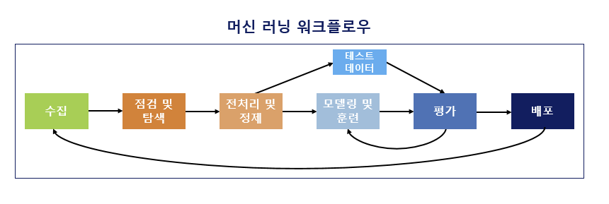
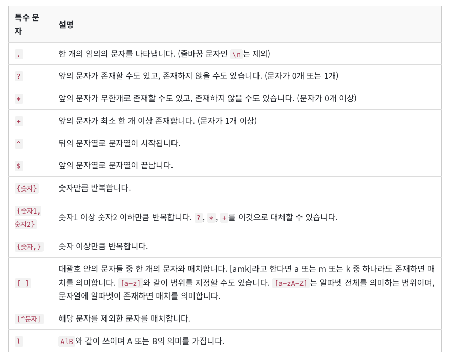
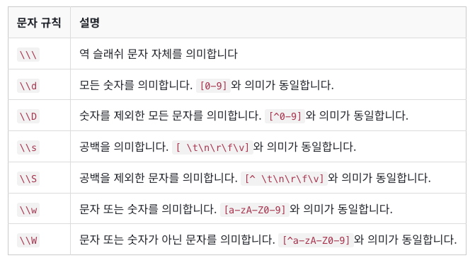
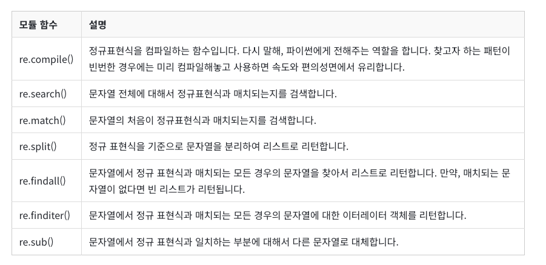

# 딥러닝을 이용한 자연어 처리 입문

`2장, 7장, 8장`을 중심으로 공부하되, 다른 장도 읽어보면서 중요한 것들 위주 정리

> LLM 을 큰 주제로 본다면 배워야할 것 : 이론적 위주
>
> - 트랜스포머 (Transformer)
> - BERT, GPT, BART, T5, GPT-3
> - PEFT(Parameter-Efficient Fine-Tuning), LLama

### 1장. 자연어 처리 (natural language processing)

**자연어(natural language)** : 일상 생활에서 사용하는 언어

**자연어 처리** : 자연어의 의미를 분석하여 컴퓨터가 처리할 수 있도록 하는 일 

- 필요 프레임워크 , 라이브러리 

> 필요한 패키지 
>
> - 코랩 (Colab) or Anaconda : 이미 설치 완료
> - Tensorflow : 구글에서 공개한 머신 러닝 오픈소스 라이브러리 
> - Keras : 딥러닝 프레임워크인 텐서플로우에 API 제공
> - Gensim : 머신러닝을 사용해 토픽 모델링과 자연어 처리를 수행을 도와주는 오픈 소스 라이브러리
> - Scikit-learn : 파이썬 머신러닝 라이브러리
> - KoNLPy : 한국어 자연어 처리를 위한 형태소 분석기 패키지

**머신 러닝 워크플로우 (Machine Learning Workflow)**

1. **수집 (Acquisition)**

- 기계에 학습시킬 데이터를 필요로 함. 자연어 데이터를 **말뭉치, 코퍼스** 라고 부르는데 조사나 연구 목적에 의해 특정 도메인으로부터 수집된 텍스트 집합을 말함. 
- 주로 txt, csv, xml 파일들로 다양하고 음성 데이터, 웹 수집기를 통해 수집함.

2. **점검 및 탐색 (Inspection and exploration)**

- 데이터를 점검하고 탐색하는 단계 
- **EDA (탐색적 데이터 분석)** 단계라고도 함. 독립, 종속, 변수 유형, 변수의 데이터 타입을 점검하며 데이터의 특징과 내재하는 구조적 관계를 알아내는 과정

3. **전처리 및 정제 (Preprocessing and Cleaning)**

- 데이터의 전처리 과정 (제일 까다로운 작업)
- 자연어 처리 : 토큰화, 정제, 정규화, 불용어 제거 등의 단계가 포함 

4. **모델링 및 훈련 (Modeling and Training)**

- 적절한 머신러닝 알고리즘을 선택해, 전처리가 완료된 데이터를 머신러닝 알고리즘을 통해 기계에게 학습을 시킴. 
- 그 이후 기계 번역, 음성 인식, 텍스트 분류 등의 자연어 처리 작업을 수행할 수 있게 함. 

- 훈련용, 테스트용, 검증용 세 가지 모두 사용함. 

5. **평가 (Evaluation)**

- 테스트용 데이터로 성능을 평가를 진행함.

6. **배포 (Deployment)**

- 완성된 모델 배포하는 단계
- 피드백을 받으면서 모델을 업데이트 해야하는 상황으로 온다면 수집단계로 돌아갈 수도 있음.

---

## 02장. 텍스트 전처리 (Text Preprocessing)

- 문제의 용도에 맞게 텍스트를 사전에 처리하는 작업 

### 02-01. 토큰화 (Tokenization)

토큰의 기준을 단어(word)로 하는경우, 단어 토큰화라고 함. 

~~~
예시)
Input : Time is an illusion. Lunchtime double so!
Result : "Time", "is", "an", "illustion", "Lunchtime", "double", "so"
~~~

> 띄어쓰기를 기준으로 잘라내는 간단한 예시 
>
> - 하지만 실제로는 그렇게 단순하지는 않음.

- 아포스트로피(') 가 들어가 있는 문장의 예시 

**Don't be fooled by the dark sounding name, Mr. Jone's Orphanage is as cheery as cheery goes for a pastry shop.**

에서 Don't 와 Jone's 는 다양한 방식으로 토큰화가 가능함. 

- word_tokenize : Don't  -> Do /  n't ,  Jone's -> Jone / 's 로 분리 

- wordPunctTokenizer : Dont't -> Don / ' / t , Jone's -> Jone / ' / s 로 분리

- 그 외에도 사용자가 원하는 결과가 나오도록 **토큰화 도구를 직접 설계도 가능**

**토큰화해서 고려해야 할 사항**

**1. 구두점이나 특수 문자를 단순 제외해서는 안된다.**

- 갖고 있는 코퍼스에서 단어들을 걸러낼 때, 구두점이나 특수 문자를 단순히 제외하는 것은 옳지 않다.
  - 마침표(.)와 같은 경우는 문장의 경계를 알 수 있는데 도움이 되기 때문에 제외하지 않을 수 있음.
- 단어 자체가 구두점을 갖고 있는 경우도 있음. 
  - 특수문자(m.p.h) 나 달러나 슬래시같은 예시
  - / 를 활용하여 날짜를 의미하기도 함. 
  - 숫자에 들어가는 쉼표도 예시에 포함될 수 있음. 

**2. 줄임말과 단어 내에 띄어쓰기가 있는 경우**

- 토큰화 작업에서 종종 영어권 언어의 아포스트로피(') 는 압축된 단어를 다시 펼치는 역할을 수행함.
- 하나의 단어 사이에 띄어쓰기가 있는 경우에도 하나의 토큰으로 봐야하는 경우가 존재

**3. 표준 토큰화 예제**

- **Penn Treebank Tokenization**
  - 규칙 1 : 하이푼으로 구성된 단어는 하나로 유지한다. 
  - 규칙 2 : doesn't 와 같이 아포스트로피로 '접어'가 함께하는 단어는 분리해준다. 

~~~
예시) 
Input : "Starting a home-based restaurant may be an ideal. it doesn't have a food chain or restaurant of their own."

print : ['Starting', 'a', 'home-based', 'restaurant', 'may', 'be', 'an', 'ideal.', 'it', 'does', "n't", 'have', 'a', 'food', 'chain', 'or', 'restaurant', 'of', 'their', 'own', '.']
~~~

**4. 문장 토큰화 (Sentence Tokenization)**

- 코퍼스 내에서 문장 단위로 구분하는 작업으로 문장 분류라고도 부름. 
  - 단순히 마침표, 물음표, 느낌표로 할 수 없음. (mail 주소, IP 주소 같은 예시)
- 사용하는 코퍼스가 어떤 국적의 언어인지, 해당 코퍼스 내에서 특수문자들이 어떻게 사용되고 있는지에 따라 직접 규칙들을 정의가 가능 
- NLTK에서는 영어 문장의 토큰화를 수행하는 **sent_tokenize**를 지원함. 

- 한국어의 경우에는 **KSS(Korean sentence Splitter)**가 있음. 

~~~
kss의 예시)
Input :'딥 러닝 자연어 처리가 재미있기는 합니다. 그런데 문제는 영어보다 한국어로 할 때 너무 어렵습니다. 이제 해보면 알걸요?'

print : ['딥 러닝 자연어 처리가 재미있기는 합니다.', '그런데 문제는 영어보다 한국어로 할 때 너무 어렵습니다.', '이제 해보면 알걸요?']
~~~

**5. 한국어에서의 토큰화의 어려움**

- 한국어의 경우, 띄어쓰기 단위가 되는 단위를 '어절' 이라고 하는데, 어절 토큰화는 한국어 NLP에서 지양되고 있음. 

  - 어절 토큰화 != 단어 토큰화

  

  **교착어**의 특성

- 영어와 다르게 한국에는 '조사' 가 존재함. 
- 한국어는 어절이 독립적인 단어로 구성되는 것이 아니라 조사 등의 무언가가 붙어있는 경우가 많아서 이를 분리해줘야함. 
- **형태소** : 뜻을 가진 가장 작은 말의 단위 
  - **자립 형태소** : 접사, 어미, 조사와 상관없이 자립하여 사용할 수 있는 형태소
  - **의존 형태소** : 다른 형태소와 결합하여 사용되는 형태소 

​	**한국어는 띄어쓰기가 영어보다 잘 지켜지지 않는다.**

- 한국어는 띄어쓰기가 지켜지지 않아도 글을 쉽게 이해할 수 있는 언어라는 특성
- 영어와 다르게 띄어쓰기를 하지 않아도 이해가 가능
  - 예시) 제가이렇게띄어쓰기를전혀하지않고글을썼다고하더라도글을이해할수있습니다.

**6. 품사 태깅 (Part-of-speech tagging)**

- 단어의 표기가 같지만, 품사에 따라서 의미가 달라지는 경우도 존재. 
- 단어의 의미를 파악하기 위해 해당 단어가 어떤 품사로 쓰였는지 보는 것이 주요 지표가 될 수 있음. 
- 한국어에서는 KoNLPy 라는 파이썬 패키지를 통해서 형태소 추출과 / 품사 태깅이 가능함. 

### 02-02. 정제 (Cleaning) and 정규화 (Normalization)

- 토큰화 작업 전과 후에는 텍스트 데이터를 용도에 맞게 정제와 정규화하는 일이 항상 함께 있음. 

**정제 (Cleaning)** : 갖고 있는 코퍼스로부터 노이즈 데이터를 제거한다.

- 보통 완벽하게 정제 작업을 할 수가 없어서 대부분 이 정도면 됐다라는 합의점을 찾음.

**정규화 (Normalization)** : 표현 방법이 다른 단어들을 통합시켜서 같은 단어로 만들어준다. 

**1. 대소문자 통합**

- 영어권 언어에서 대, 소문자를 통합하는 것은 단어의 개수를 줄일 수 있는 정규화 방법
- 물론, 무작정 통합은 하면 안됨. -> US, us 는 다른뜻을 가짐. 

**2. 불필요한 단어의 제거**

**noise data** : 자연어가 아니면서 아무 의미도 갖지 않는 글자들 (특수 문자 등) 또는 분석하고자 하는 목적에 맞지 않는 불필요한 단어들 

- **등장 빈도가 적은 단어** 
- **길이가 짧은 단어**
  - 영어권 언어에서 길이가 짧은 단어들은 대부분 불용어에 해당 
- **정규 표현식 (Regular Expression)**

### 02-03. 어간 추출 (Stemming) and 표제어 추출(Lemmatization)

하나의 단어로 일반화를 시켜서 문서 내의 단어 수를 줄이겠다는 뜻을 가짐. 

**1. 표제어 추출 (Lemmatization)**

- 단어들로부터 표제어를 찾아가는 과정
  - am, are, is => `be`
- 방법 : 단어의 형태학적 파싱을 먼저 진행하는 것 
  - **어간 / 접사**로 구분을 함. 

**2. 어간 추출 (Stemming)**

- 말 그대로 어간을 추출하는 작업 
  - 형태학적 분석을 단순화한 버전 
- 표제어 추출보다는 어간 추출 속도가 더 빠름. 

> **한국어에서의 어간 추출**
>
> - 활용(conjugation) : 활용 -> 용언의 어간이 어미를 가지는 일
> - 규칙 활용 : 어간이 어미를 취할 때, 어간의 모습이 일정 
> - 불규칙 활용 : 어간이 어미를 취할 때 어간의 모습이 바뀌거나 취하는 어미가 특수한 어미일 경우를 말함. 

### 02-04. 불용어 (Stopword)

자주 등장은 하지만 분석을 하는 것에 도움이 되지 않는 단어들을 제거하는 작업이 필요함. 

- 이러한 단어들을 **불용어 (Stopword)** 라고 부름. 
- 한국어에서의 불용어 제거 방법
  - 토큰화 후에 조사, 접속사 등을 제거하는 방법
  - 사용자가 직접 불용어 사전을 만들게 되는 경우도 존재.
  - 너무 많은 경우 : txt 파일이나, csv 파일에 정리해놓고 불러와서 사용도 함.

### 02-05. 정규 표현식 (Regular Expression)

파이썬에서는 정규 표현식 모듈 `re` 를 지원, 특정 규칙이 있는 텍스트 데이터를 빠르게 정제가 가능

- 정규 표현식 문법 

- 정규 표현식 모듈 함수 

