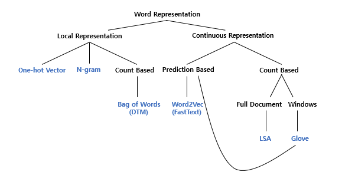
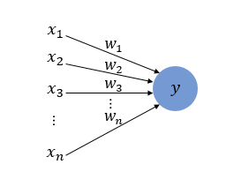
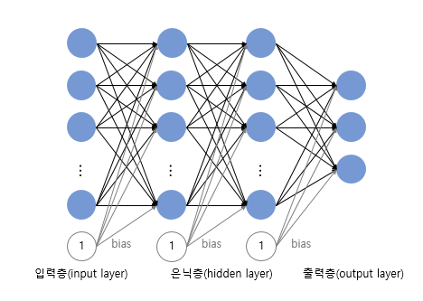

# 딥러닝을 이용한 자연어 처리 입문

`2장, 7장, 8장`을 중심으로 공부하되, 다른 장도 읽어보면서 중요한 것들 위주 정리

> LLM 을 큰 주제로 본다면 배워야할 것 : 이론적 위주
>
> - 트랜스포머 (Transformer)
> - BERT, GPT, BART, T5, GPT-3
> - PEFT(Parameter-Efficient Fine-Tuning), LLama

### 1장. 자연어 처리 (natural language processing)

**자연어(natural language)** : 일상 생활에서 사용하는 언어

**자연어 처리** : 자연어의 의미를 분석하여 컴퓨터가 처리할 수 있도록 하는 일 

- 필요 프레임워크 , 라이브러리 

> 필요한 패키지 
>
> - 코랩 (Colab) or Anaconda : 이미 설치 완료
> - Tensorflow : 구글에서 공개한 머신 러닝 오픈소스 라이브러리 
> - Keras : 딥러닝 프레임워크인 텐서플로우에 API 제공
> - Gensim : 머신러닝을 사용해 토픽 모델링과 자연어 처리를 수행을 도와주는 오픈 소스 라이브러리
> - Scikit-learn : 파이썬 머신러닝 라이브러리
> - KoNLPy : 한국어 자연어 처리를 위한 형태소 분석기 패키지

**머신 러닝 워크플로우 (Machine Learning Workflow)**

1. **수집 (Acquisition)**

- 기계에 학습시킬 데이터를 필요로 함. 자연어 데이터를 **말뭉치, 코퍼스** 라고 부르는데 조사나 연구 목적에 의해 특정 도메인으로부터 수집된 텍스트 집합을 말함. 
- 주로 txt, csv, xml 파일들로 다양하고 음성 데이터, 웹 수집기를 통해 수집함.

2. **점검 및 탐색 (Inspection and exploration)**

- 데이터를 점검하고 탐색하는 단계 
- **EDA (탐색적 데이터 분석)** 단계라고도 함. 독립, 종속, 변수 유형, 변수의 데이터 타입을 점검하며 데이터의 특징과 내재하는 구조적 관계를 알아내는 과정

3. **전처리 및 정제 (Preprocessing and Cleaning)**

- 데이터의 전처리 과정 (제일 까다로운 작업)
- 자연어 처리 : 토큰화, 정제, 정규화, 불용어 제거 등의 단계가 포함 

4. **모델링 및 훈련 (Modeling and Training)**

- 적절한 머신러닝 알고리즘을 선택해, 전처리가 완료된 데이터를 머신러닝 알고리즘을 통해 기계에게 학습을 시킴. 
- 그 이후 기계 번역, 음성 인식, 텍스트 분류 등의 자연어 처리 작업을 수행할 수 있게 함. 

- 훈련용, 테스트용, 검증용 세 가지 모두 사용함. 

5. **평가 (Evaluation)**

- 테스트용 데이터로 성능을 평가를 진행함.

6. **배포 (Deployment)**

- 완성된 모델 배포하는 단계
- 피드백을 받으면서 모델을 업데이트 해야하는 상황으로 온다면 수집단계로 돌아갈 수도 있음.

---

## 02장. 텍스트 전처리 (Text Preprocessing)

- 문제의 용도에 맞게 텍스트를 사전에 처리하는 작업 

### 02-01. 토큰화 (Tokenization)

토큰의 기준을 단어(word)로 하는경우, 단어 토큰화라고 함. 

~~~
예시)
Input : Time is an illusion. Lunchtime double so!
Result : "Time", "is", "an", "illustion", "Lunchtime", "double", "so"
~~~

> 띄어쓰기를 기준으로 잘라내는 간단한 예시 
>
> - 하지만 실제로는 그렇게 단순하지는 않음.

- 아포스트로피(') 가 들어가 있는 문장의 예시 

**Don't be fooled by the dark sounding name, Mr. Jone's Orphanage is as cheery as cheery goes for a pastry shop.**

에서 Don't 와 Jone's 는 다양한 방식으로 토큰화가 가능함. 

- word_tokenize : Don't  -> Do /  n't ,  Jone's -> Jone / 's 로 분리 

- wordPunctTokenizer : Dont't -> Don / ' / t , Jone's -> Jone / ' / s 로 분리

- 그 외에도 사용자가 원하는 결과가 나오도록 **토큰화 도구를 직접 설계도 가능**

**토큰화해서 고려해야 할 사항**

**1. 구두점이나 특수 문자를 단순 제외해서는 안된다.**

- 갖고 있는 코퍼스에서 단어들을 걸러낼 때, 구두점이나 특수 문자를 단순히 제외하는 것은 옳지 않다.
  - 마침표(.)와 같은 경우는 문장의 경계를 알 수 있는데 도움이 되기 때문에 제외하지 않을 수 있음.
- 단어 자체가 구두점을 갖고 있는 경우도 있음. 
  - 특수문자(m.p.h) 나 달러나 슬래시같은 예시
  - / 를 활용하여 날짜를 의미하기도 함. 
  - 숫자에 들어가는 쉼표도 예시에 포함될 수 있음. 

**2. 줄임말과 단어 내에 띄어쓰기가 있는 경우**

- 토큰화 작업에서 종종 영어권 언어의 아포스트로피(') 는 압축된 단어를 다시 펼치는 역할을 수행함.
- 하나의 단어 사이에 띄어쓰기가 있는 경우에도 하나의 토큰으로 봐야하는 경우가 존재

**3. 표준 토큰화 예제**

- **Penn Treebank Tokenization**
  - 규칙 1 : 하이푼으로 구성된 단어는 하나로 유지한다. 
  - 규칙 2 : doesn't 와 같이 아포스트로피로 '접어'가 함께하는 단어는 분리해준다. 

~~~
예시) 
Input : "Starting a home-based restaurant may be an ideal. it doesn't have a food chain or restaurant of their own."

print : ['Starting', 'a', 'home-based', 'restaurant', 'may', 'be', 'an', 'ideal.', 'it', 'does', "n't", 'have', 'a', 'food', 'chain', 'or', 'restaurant', 'of', 'their', 'own', '.']
~~~

**4. 문장 토큰화 (Sentence Tokenization)**

- 코퍼스 내에서 문장 단위로 구분하는 작업으로 문장 분류라고도 부름. 
  - 단순히 마침표, 물음표, 느낌표로 할 수 없음. (mail 주소, IP 주소 같은 예시)
- 사용하는 코퍼스가 어떤 국적의 언어인지, 해당 코퍼스 내에서 특수문자들이 어떻게 사용되고 있는지에 따라 직접 규칙들을 정의가 가능 
- NLTK에서는 영어 문장의 토큰화를 수행하는 **sent_tokenize**를 지원함. 

- 한국어의 경우에는 **KSS(Korean sentence Splitter)**가 있음. 

~~~
kss의 예시)
Input :'딥 러닝 자연어 처리가 재미있기는 합니다. 그런데 문제는 영어보다 한국어로 할 때 너무 어렵습니다. 이제 해보면 알걸요?'

print : ['딥 러닝 자연어 처리가 재미있기는 합니다.', '그런데 문제는 영어보다 한국어로 할 때 너무 어렵습니다.', '이제 해보면 알걸요?']
~~~

**5. 한국어에서의 토큰화의 어려움**

- 한국어의 경우, 띄어쓰기 단위가 되는 단위를 '어절' 이라고 하는데, 어절 토큰화는 한국어 NLP에서 지양되고 있음. 

  - 어절 토큰화 != 단어 토큰화

  

  **교착어**의 특성

- 영어와 다르게 한국에는 '조사' 가 존재함. 
- 한국어는 어절이 독립적인 단어로 구성되는 것이 아니라 조사 등의 무언가가 붙어있는 경우가 많아서 이를 분리해줘야함. 
- **형태소** : 뜻을 가진 가장 작은 말의 단위 
  - **자립 형태소** : 접사, 어미, 조사와 상관없이 자립하여 사용할 수 있는 형태소
  - **의존 형태소** : 다른 형태소와 결합하여 사용되는 형태소 

​	**한국어는 띄어쓰기가 영어보다 잘 지켜지지 않는다.**

- 한국어는 띄어쓰기가 지켜지지 않아도 글을 쉽게 이해할 수 있는 언어라는 특성
- 영어와 다르게 띄어쓰기를 하지 않아도 이해가 가능
  - 예시) 제가이렇게띄어쓰기를전혀하지않고글을썼다고하더라도글을이해할수있습니다.

**6. 품사 태깅 (Part-of-speech tagging)**

- 단어의 표기가 같지만, 품사에 따라서 의미가 달라지는 경우도 존재. 
- 단어의 의미를 파악하기 위해 해당 단어가 어떤 품사로 쓰였는지 보는 것이 주요 지표가 될 수 있음. 
- 한국어에서는 KoNLPy 라는 파이썬 패키지를 통해서 형태소 추출과 / 품사 태깅이 가능함. 

### 02-02. 정제 (Cleaning) and 정규화 (Normalization)

- 토큰화 작업 전과 후에는 텍스트 데이터를 용도에 맞게 정제와 정규화하는 일이 항상 함께 있음. 

**정제 (Cleaning)** : 갖고 있는 코퍼스로부터 노이즈 데이터를 제거한다.

- 보통 완벽하게 정제 작업을 할 수가 없어서 대부분 이 정도면 됐다라는 합의점을 찾음.

**정규화 (Normalization)** : 표현 방법이 다른 단어들을 통합시켜서 같은 단어로 만들어준다. 

**1. 대소문자 통합**

- 영어권 언어에서 대, 소문자를 통합하는 것은 단어의 개수를 줄일 수 있는 정규화 방법
- 물론, 무작정 통합은 하면 안됨. -> US, us 는 다른뜻을 가짐. 

**2. 불필요한 단어의 제거**

**noise data** : 자연어가 아니면서 아무 의미도 갖지 않는 글자들 (특수 문자 등) 또는 분석하고자 하는 목적에 맞지 않는 불필요한 단어들 

- **등장 빈도가 적은 단어** 
- **길이가 짧은 단어**
  - 영어권 언어에서 길이가 짧은 단어들은 대부분 불용어에 해당 
- **정규 표현식 (Regular Expression)**

### 02-03. 어간 추출 (Stemming) and 표제어 추출(Lemmatization)

하나의 단어로 일반화를 시켜서 문서 내의 단어 수를 줄이겠다는 뜻을 가짐. 

**1. 표제어 추출 (Lemmatization)**

- 단어들로부터 표제어를 찾아가는 과정
  - am, are, is => `be`
- 방법 : 단어의 형태학적 파싱을 먼저 진행하는 것 
  - **어간 / 접사**로 구분을 함. 

**2. 어간 추출 (Stemming)**

- 말 그대로 어간을 추출하는 작업 
  - 형태학적 분석을 단순화한 버전 
- 표제어 추출보다는 어간 추출 속도가 더 빠름. 

> **한국어에서의 어간 추출**
>
> - 활용(conjugation) : 활용 -> 용언의 어간이 어미를 가지는 일
> - 규칙 활용 : 어간이 어미를 취할 때, 어간의 모습이 일정 
> - 불규칙 활용 : 어간이 어미를 취할 때 어간의 모습이 바뀌거나 취하는 어미가 특수한 어미일 경우를 말함. 

### 02-04. 불용어 (Stopword)

자주 등장은 하지만 분석을 하는 것에 도움이 되지 않는 단어들을 제거하는 작업이 필요함. 

- 이러한 단어들을 **불용어 (Stopword)** 라고 부름. 
- 한국어에서의 불용어 제거 방법
  - 토큰화 후에 조사, 접속사 등을 제거하는 방법
  - 사용자가 직접 불용어 사전을 만들게 되는 경우도 존재.
  - 너무 많은 경우 : txt 파일이나, csv 파일에 정리해놓고 불러와서 사용도 함.

### 02-05. 정규 표현식 (Regular Expression)

파이썬에서는 정규 표현식 모듈 `re` 를 지원, 특정 규칙이 있는 텍스트 데이터를 빠르게 정제가 가능

- 정규 표현식 문법 

- 정규 표현식 모듈 함수 

(1) `re.match()` 와  `re.search()` 의 차이

- search() 는 정규 표현식 전체에 대해서 문자열이 매치하는지를 확인

- Match() 는 문자열의 첫 부분부터 정규 표현식과 매치하는지를 확인 

(2) `re.split()`

- 입력된 정규 표현식을 기준으로 문자열들을 분리하여 리스트로 리턴
  - 토큰화에 유용하게 주로 쓰임. 

(3) `re.findall()`

- 정규표현식과 매치되는 모든 문자열들을 리스트로 리턴
- 매치되는 문자열이 없는 경우네는 빈 리스트를 리턴

(4) `re.sub()`

- 정규 표현식과 일치하는 문자열을 찾아 다른 문자열로 대체

### 02-06. 정수 인코딩(Integer Encoding)

컴퓨터는 텍스트보다 숫자를 더 잘 처리하기에 텍스트를 숫자로 바꾸는 기법들이 존재

**1. 정수 인코딩 (Integer Encoding)**

- 단어에 정수를 부여하는 방법 중 하나로 단어를 빈도수 순으로 정렬한 단어 집합을 만듦.
- 빈도수가 높은 순서대로 차례로 낮은 숫자부터 부여하는 방법
- Dicionary , Counter , NLTK의 FreqDist, enumerate 를 통해 구현 가능

### 02-07. 패딩 (Padding)

각 문장, 문서의 길이가 서로 다를 수 있다. 

- 즉, 병렬 연산을 위해서 여러 문장의 길이를 임의로 동일하게 맞춰주는 작업이 필요함. 

> 이게 그때 DARtv 학술제때 사용했던 기법 같음. 

- 데이터에 특정 값을 채워서 데이터의 크기를 조정하는 것을 **패딩**이라고 함. 
  - 숫자 0을 사용하고 있다면 **제로 패딩(zero padding)**이라고 함. 

~~~
예시 )
array([[ 1,  5,  0,  0,  0,  0,  0],
       [ 1,  8,  5,  0,  0,  0,  0],
       [ 1,  3,  5,  0,  0,  0,  0],
       [ 9,  2,  0,  0,  0,  0,  0],
       [ 2,  4,  3,  2,  0,  0,  0],
       [ 3,  2,  0,  0,  0,  0,  0],
       [ 1,  4,  6,  0,  0,  0,  0],
       [ 1,  4,  6,  0,  0,  0,  0],
       [ 1,  4,  2,  0,  0,  0,  0],
       [ 7,  7,  3,  2, 10,  1, 11],
       [ 1, 12,  3, 13,  0,  0,  0]])
~~~

### 02-08. 원-핫 인코딩 (One-Hot Encoding)

**단어 집합 (Vocaubulary)** : 서로 다른 단어들의 집합

- 원-핫 인코딩을 수행하기 전 해야할 일 : 단어 집합을 만드는 일
- 단어의 중복을 허용하지 않고 모아놓은 것을 단어 집합. -> 여기에 고유한 정수를 부여하는 정수 인코딩을 진행

​	**원-핫 인코딩 (One-Hot Encoding)**

- 단어 집합의 크기를 벡터의 차원으로 하고, 표현하고 싶은 단어의 인덱스에 1의 값을 부여하고, 다른 인덱스에는 0을 부여하는 벡터 표현 방식 
  - 이때 표현된 벡터는 **원-핫 벡터**라고 함. 
- 두 가지의 과정으로 설명 가능
  - 1. 정수 인코딩을 수행  : 각 단어에 고유한 정수 부여
  - 2. 표현하고 싶은 단어의 고유한 정수를 인덱스로 간주하고 해당 위치에 1부여, 다른 위치에는 0을 부여함. 
- Keras에서는 원-핫 인코딩을 수행하는 도구로 `to_categorical()` 을 지원함. 

**한계**

- 단어의 개수가 늘어날 수록, 벡터를 저장하기 위해 필요한 공간이 계속 늘어남. 
- 단어의 유사도를 표현하지 못함. 
  - 검색 시스템에서 문제가 될 부분
- 해결 방법 : **카운트 기반의 LSA, HAL**  / **예측 기반 벡터화 하는 NNLM, RNNLM, Word2Vec, FastText** 가 존재

### 02-09. 데이터의 분리 (Supervised Learning)

머신 러닝 모델을 학습시키고, 평가하기 위해서는 데이터를 적절하게 분리하는 작업이 필요함. 

**1. 지도 학습 (Supervised Learning)**

- 지도학습의 훈련 데이터는 정답이 무엇인가 맞춰 하는 '문제'에 해당되는 데이터와 레이블이라고 부르는 '정답'이 적혀있는 데이터로 구성되어있다. 

~~~
<훈련 데이터>
X_train : 문제지 데이터
y_train : 문제지에 대한 정답 데이터.

<테스트 데이터>
X_test : 시험지 데이터.
y_test : 시험지에 대한 정답 데이터.
~~~

- 분리하는 작업은 `zip 함수` , `데이터 프레임을 이용한 분리` , `Numpy를 이용한 분리` 가 가능 

### 02-10. 한국어 전처리 패키지 (Text Preprocessing Tools for Korean Text)

- 패키지 정리

~~~
1. PyKospacing
- 띄어쓰기 되어있지 않은 문장을 띄어쓰기를 한 문장으로 변환해주는 패키지 

2. Py-Hanspell
- 현재는 잘 동작하지 않음. (2024-3월 기준)
- 네이버 한글 맞춤법 검사기를 바탕으로 만들어진 패키지 
- 띄어쓰기 또한 보정도 가능

3. SOYNLP를 이용한 단어 토큰화 
- 품사 태깅, 단어 토큰화 등을 지원하는 단어 토크나이저 
- 비지도 학습으로 단어 토큰화를 한다는 특징을 가지고 있음. 
~~~

### 3장 ~ 6장

> 중요해보이는 것들만 간단히 정리 

**언어 모델 (Language Model)을 만드는 방법**

- 언어 모델 : **단어 시퀀스에 확률을 할당(assign)** 하는 일을 하는 모델
  - 다음 단어 시퀀스를 찾아내는 모델, **이전 단어들을 주어졌을 때 다음 단어를 예측**
- **통계를 이용하는 방법, 인공신경망을 이용한 방법** 크게 2가지 존재 

**한국어에서의 언어 모델** ㅠㅠ 

- 한국어는 어순이 중요하지 않음. 
- 한국어는 교착어임. 
- 띄어쓰기가 제대로 지켜지지 않음. 

**PPL : 펄플렉서티 (perplexity)**

- **언어 모델을 평가하기 위한 평가 지표**
  $$
  PPL(W) = P(w_1, w_2, w_3, \ldots, w_N)^{-\frac{1}{N}}
  = \sqrt[N]{\frac{1}{P(w_1, w_2, w_3, \ldots, w_N)}}
  $$

  $$
  PPL(W) = \sqrt[N]{\frac{1}{P(w_1, w_2, \ldots, w_N)}}
  = \sqrt[N]{\frac{1}{\prod_{i=1}^N P(w_i \mid w_1, w_2, \ldots, w_{i-1})}}
  $$

  

**단어 표현의 카테고리화**

**Bag of Words (BOW)**

- 단어의 등장 순서를 고려하지 않는 빈도수 기반의 단어 표현 방법

~~~
- BoW 만드는 과정
(1) 각 단어에 고유한 정수 인덱스를 부여합니다.  # 단어 집합 생성.
(2) 각 인덱스의 위치에 단어 토큰의 등장 횟수를 기록한 벡터를 만듭니다.
~~~

**코사인 유사도 (Cosine Similarity)**

- 두 벡터 간의 코사인 각도를 이용하여 구할 수 있는 벡터의 유사도를 의미
- 방향이 동일하면 1, 180 도 면 -1 을 가짐. 

- 그 외 여러가지 문서의 유사도 기법이 존재

~~~
- 유클리드 거리 
- 자카드 유사도 (합집합과 교집합의 비율을 통해 구함)

~~~

## 07. 딥 러닝 (Deep Learning) 의 개요

Deep learning : Machine learning의 한 분야로서 **인공 신경망**의 층을 연속적으로 깊게 쌓아올려 데이터를 학습하는 방식 

### 07-01. 퍼셉트론 (Perceptron)

**퍼셉트론**

- **초기의 인공신경망**
- 다수의 입력으로부터 하나의 결과를 내보내는 알고리즘 

- `x` 는 입력 값, `w` 는 가중치 , `y`는 출력값 
- 원은 인공뉴런에 해당
  - 각각의 인공뉴런에서 보내진 입력값 x는 각각의 가중치 w와 함께 종착지인 인공 뉴런에 전달 
  - 가중치가 존재하는데, 가중치의 값이 클수록 해당 입력 값이 중욯다ㅏ는 것을 의미 
  - 각 입력값과 가중치의 곱의 전체 합이 **임계치 (threshold)**를 넘으면 종착치에 있는 인공 뉴런은 1을 출력, 그렇지 않을 경우에는 0을 출력 

- 뉴런에서 출력값을 변경시키는 함수 : **활성화 함수 (Activation Function)**
  - 초기에는 계단 함수를 사용했지만, 그 이후에는 다양한 활성화 함수를 사용함. 

> **로지스틱 회귀 모델** : 인공 신경망에서는 하나의 인공 뉴런
>
> - 로지스틱 회귀를 수행하는 인공 뉴런과 퍼셉트론의 차이는 오직 활성화 함수의 차이 

​	**단층 퍼셉트론 (Single - Layer Perceptron)**

- 값을 보내는 단계랑 값을 받아서 출력하는 두 단계로만 이루어져있음. 
  - 각 단계는 = **층 (layer)** / 입력층과 출력층으로 이루어져 있음.
- AND, NAND, OR 게이트를 구현 가능함. 
- 단 **XOR 게이트는** 구현이 불가능하다. 

​	**다층 퍼셉트론 (MultiLayer Perceptron, MLP)**

- 층을 더 쌓으면 만들 수 있다. 
- 단층 : 입력층과 출력층만 존재한다. / 다층 : 중간에 층을 더 추가하였다. 
  - 중간 층 = **은닉층 (hidden layer)**
- 은닉층이 2개 이상인 신경망 -> **심층 신경망 (Deep Neural Network, DNN)**
  - 여러 변형된 다양한 신경망들도 은닉층이 2개 이상이되면 심층 신경망이라고 부름.

> 기계가 가중치를 스스로 찾아내도록 자동화 시키는 단계
>
> **훈련** 또는 **학습**단계라고 부른다. 그리고 **손실함수 (Loss function)**과 **Optimizer**를 사용한다. 

**학습을 시키는 인공 신경망이 심층 신경망일경우 이를 심층 신경망을 학습시킨다고 하여, 딥 러닝**이라고 부른다. 

### 07-02. 인공 신경망 (Artificial Neural Network)

**피드 포워드 신경망 (Feed-Forwar Neural Network, FFNN)**

- 다중 퍼셉트론과 같이 오직 입력층에서 출력층 방향으로 연산이 전개되는 신경망

**전결합층 (Fully-connected layer, FC, Dense layer)**

- 어떤 층의 모든 뉴런이 이전 층의 모든 뉴런과 연결돼 있는 층
- 완전 연결층이라고도 함. 
- **밀집층**이라고도 하는데, 밀집층을 구현할 때 Dense() 를 사용함. 

**활성화 함수 (Activation Function)**

- 은닉층과 출력층의 뉴런에서 출력값을 결정하는 함수 
- 특징
  - **비선형 함수** : 활성화 함수로 선형함수를 사용하게 되면 은닉층을 쌓을 수가 없다. 
  - **계단 함수** : 거의 사용되지는 않음. 
  - **시그모이드 함수 (Sigmoid Function)** : 입력에 대한 순전파 연산을 하고, 순전파 연산을 통해 나온 예측/실젝밧의 오차를 손실 함수를 통해 계산. 역전파 과정에서는 인공 신경망은 경사 하강법을 사용함. 

> 시그모이드 함수를 미분한 값은 적어도 0.25 이하의 값 
>
> 시그모이드를 활성화 함수로 하는 인공 신경망의 층을 쌓으면, 기울기가 잘 전달되지 않게 됨. 
>
> - 이러한 현상을 **기울기 소실 문제**라고 함. 

**하이퍼볼릭탄젠트 함수 (Hyperbolic tangent function)**

- 입력값을 -1과 1 사이로 변환
- 0을 중심으로 하고 있고, 기울기 소실 증상이 적은 편임.
- 은닉층에서 많이 선호

**렐루 함수 (ReLU)**

- 인공 신경망에서 가장 인기있는 함수 
  $$
  f(x) = max(0, x)
  $$

  - 음수를 입력하면 0을 출력, 양수 입력하면 그대로 반환

**리키 렐루 (Leaky ReLU)**

- 죽은 렐루를 보완하기 위해 등장

- 입력값이 음수일 경우에 0이 아니라 0.001과 같은 매우 작은 수를 반환 
  $$
  f(x) = max(ax, x)
  $$
  

**소프트맥수 함수 (Softmax Function)**

- 시그모이드 함수처럼 출력층에서 주로 사용함. 

### 07-03. 행렬곱으로 이해하는 신경망

**순전파**

- 입력층에서 출력층 방향으로 연산을 진행하는 과정
- 활성화 함수, 은닉층의 수, 각 은닉층의 뉴런 수 등 딥러닝 모델을 설계하면 입력값은 **입력층, 은닉층을 지나면서 각 층에서의 가중치와 함께 연산되며 출력층으로 향함.**

- **구조**: 입력층 뉴런 3개 → 출력층 뉴런 2개.
- **가중치**: 입력(3) × 출력(2) = 6개의 가중치 존재.
- **편향**: 출력 차원(2)에 따라 편향도 2개 존재.
- **총 매개변수**: 6(가중치) + 2(편향) = 8개. → model.summary() 결과와 동일.

### 07-04. 딥 러닝의 학습 방법

**손실 함수 (Loss Function)**

- 실제값과 예측값의 차이를 수치화해주는 함수 
- 오차가 클수록 손실함수 값은 크고 오차가 작을수록 손실 함수의 값은 작아진다. 

​	**MSE (Mean Squared Error, MSE)**

- **평균제곱오차** : 선형 회귀 학습때 배운 손실 함수, 연속형 변수를 예측할 때 사용

​	

​	**이진 크로스 엔트로피 (Binary Cross-Entropy)**

- 출력층에서 시그모이드 함수를 사용하는 이진 분류의 경우 사용

​	**카테고리칼 크로스 엔트로피 (Categorical Cross-Entropy)**

- 범주형 교차 엔트로피라고 부르는 손실함수 

**배치 크기 (Batch Size)에 따른 경사 하강법**

**배치** : 가중치 등의 매개변수의 값을 조정하기 위해 사용하는 데이터의 양 

- 전체 데이터를 가지고 매개변수 값 조정하거나, 정해준 양만 가지고 매개 변수의 값을 조정 가능함. 

- **배치 경사 하강법** : 가장 기본적 , 시간이 오래 걸리며 메모리를 크게 요구
- **확률적 경사 하강법** : 랜덤으로 선택한 하나의 데이터만 
- **미니 배치 경사 하강법** : 배치 크기를 지정해 해당 데이터 개수만큼 계산

**옵티마이저 (Optimizer)**

1. 모멘텀 (Momentum)

- 경사 하강법에서 계산된 접선의 기울기에 한 시점 전의 접선의 기울기값을 일정한 비율만큼 반영
- 전체 함수에 걸쳐 최솟값을 **글로벌 미니멈**,특정 구역에서의 최솟값을 **로컬 미니멈**이라고 함. 

2. 아다그라드 (Adagrad)

- 모든 매개변수에 서로 다른 학습률을 적용시키는 것

그 외 : 알엠에스프롭, 아담이 존재

### 07-05. 역전파 이해하기

**역전파 (BackPropagation)**

- **출력에서 입력 방향으로 오차를 전파**하면서, **연쇄법칙으로 미분**을 계산해 **경사하강법으로 가중치를 갱신**하는 알고리즘

**역전파 1단계 (출력층 → 은닉층)**

- 목표: 출력층 가중치 업데이트

- 경사하강법:
  $$
  w := w - \eta \frac{\partial E}{\partial w}
  $$
  

- 연쇄법칙(Chain Rule)으로
  $$
  \frac{\partial E}{\partial w} = \frac{\partial E}{\partial output} \cdot \frac{\partial output}{\partial net} \cdot \frac{\partial net}{\partial w}
  $$
  

- 여기서 시그모이드의 미분:
  $$
  \sigma’(z) = \sigma(z)(1 - \sigma(z))
  $$
  

**역전파 2단계 (은닉층 → 입력층)**

- 은닉층 가중치도 같은 원리로 업데이트
- 출력층에서 거꾸로 전달되는 오차(δ)를 이용해 은닉층 가중치의 기울기 계산

### 07-06. 과적합 (Overfitting)을 막는 방법들

**1. 데이터 늘리기**

- 데이터 양이 적으면 노이즈까지 학습 → 과적합 발생 ↑

- 해결책: 데이터 수집, **데이터 증강(Augmentation)**

  - 이미지: 회전, 노이즈 추가, 크롭 등
  - 텍스트: **역번역(Back Translation)** 등

  

**2. 모델 복잡도 줄이기**

- 은닉층/매개변수 수가 많으면 과적합 위험 ↑
- 해결책: **뉴런 수·층 수 줄이기** → 모델 수용력(capacity) 축소

**3. 가중치 규제 (Regularization)**

- **L1 규제**: 가중치 절대값 합 최소화 → 일부 가중치 = 0 (특성 선택 효과)
- **L2 규제**: 가중치 제곱합 최소화 → 가중치가 0에 가까워짐 (weight decay)
- L2가 경험적으로 더 자주 사용됨

**4. 드롭아웃 (Dropout)**

- 학습 중 무작위로 일부 뉴런을 꺼서 학습
- 특정 뉴런/조합에 과도한 의존 방지
- 여러 신경망을 앙상블한 효과 → 과적합 감소
- 예측(inference) 시에는 사용 X

### 07-07.기울기 소실(Gradient Vanishing)과 폭주(Exploding)

**문제 정의**

- **기울기 소실** : 역전파 시 입력층 쪽으로 갈수록 기울기가 0에 가까워져 학습이 멈춤. (주로 Sigmoid/Tanh에서 발생)
- **기울기 폭주**: 역전파 시 기울기가 점차 커져 가중치가 발산. (RNN에서 자주 발생)

**해결 방법**

1) **활성화 함수 선택**

- Sigmoid/Tanh → 기울기 소실 위험 ↑
- **ReLU, Leaky ReLU** 계열 사용 → 소실 완화, 죽은 ReLU 방지

2. **그래디언트 클리핑 (Gradinet Clipping)**

- 기울기가 임계값 이상 커지면 잘라내기 → 폭주 방지
- 주로 **RNN** 학습에서 활용

3. **가중치 초기화 (Weight Initialization)**

- 초기값에 따라 학습 안정성이 크게 달라짐
- **Xavier(Glorot) 초기화**: Sigmoid/Tanh에 적합 → 층 간 분산 균형
- **He 초기화**: ReLU 계열에 적합 → 현재 가장 보편적 (ReLU + He)

4. **배치 정규화 (Batch Normalization)**

- 각 층 입력을 평균 0, 분산 1로 정규화 → 기울기 안정화
- 효과:
  - 기울기 소실·폭주 완화
  - 초기화 민감도 ↓
  - 큰 학습률 사용 가능 → 학습 속도 ↑
  - 과적합 완화 (노이즈 주입 효과)
- 한계:
  - 미니배치 크기에 의존
  - RNN에 적용 어려움 → 대안: **층 정규화 (Layer Normalization)**

5. **층 정규화 (Layer Normalization)**

- 배치 정규화는 **배치 단위**로 정규화
- 층 정규화는 **특성 단위**로 정규화 (샘플별로 정규화)
- 배치 크기에 의존하지 않고 RNN에도 적용 가능

## 07-08. 케라스 (Keras) 훑어보기

1. 전처리

- Tokenizer: 말뭉치 → 정수 시퀀스(단어집합 생성: fit_on_texts, 인코딩: texts_to_sequences)
- pad_sequences: 길이 맞추기(앞/뒤 패딩, 자르기)

2. 임베딩

- 역할: 정수 시퀀스 → 밀집 벡터(단어 임베딩)
- 입력/출력 형태: (batch, seq_len) → (batch, seq_len, embed_dim)
- 주요 인자: input_dim(단어집합 크기), output_dim(임베딩 차원), input_length(시퀀스 길이)

3. 모델링 

- Sequential().add(...)로 층을 순차적으로 쌓음
- 자주 쓰는 층
  - Embedding(input_dim, output_dim, input_length)
  - Dense(units, activation=...)
  - (필요 시) SimpleRNN/LSTM/GRU, Conv2D, BatchNormalization 등
- model.summary()로 파라미터와 출력 shape 확인

4. 컴파일 & 학습

- compile(optimizer=..., loss=..., metrics=[...])

  - 회귀: loss='mse', 출력 활성화 없음(선형)
  - 이진 분류: loss='binary_crossentropy', 출력 sigmoid
  - 다중 분류(원-핫): loss='categorical_crossentropy', 출력 softmax
  - 다중 분류(정수 라벨): loss='sparse_categorical_crossentropy', 출력 softmax

- fit(X, y, epochs, batch_size, validation_data|validation_split, verbose)

  - validation_*로 과적합 모니터링(loss 하락 정체/상승 시 과적합 신호)

  

5. 평가 & 예측 -> 6. 저장

### 07-09. 케라스의 함수형 API

왜 사용하는가? -> Keras Functional API 의 핵심

- **Sequential의 한계 보완**: 분기/병합, **다중 입력·다중 출력**, **레이어 공유**, **스킵 연결(Residual)** 등 복잡한 구조 표현.
- **계산 그래프(DAG)**로 모델을 정의: 유연하지만 순환 구조(사이클)는 불가.

- 입력 정의 , 층 연결, 모델 생성

**자주 쓰는 패턴**

- 다중 입력, 다중 출력, 레이어 공유 , 스킨/병합, RNN / CNN도 동일 방식

- **Input에 shape 필수**(배치 차원 제외).
- **연결은 함수 호출**: next = Layer(...)(prev).
- **병합 시 차원 맞추기**: concatenate(축 지정), Add(동일 shape).
- **레이어 재사용 시** 같은 가중치 공유(의도하지 않은 공유 주의).
- **summary()**로 입·출력 shape, 파라미터 확인.

**Functional을 고르는 기준**

- 입력/출력이 여러 개, 중간에 분기/병합, 스킵 연결, 레이어 공유가 필요할 때 → **Functional**
- 단순 위에서 아래로 층만 쌓을 때 → **Sequential**

### 07-10. 케라스 서브클래싱 API (Keras Subclassing API)

- **세 번째 구현 방식**: Sequential → Functional → Subclassing
- tf.keras.Model을 상속받아 클래스 형태로 모델 정의
- __init__(): 레이어 정의 및 초기화
- call(x): 순전파(forward) 연산 정의

> 07-11. 은 실습이니 패쓰~~ (안 읽은거 아님)

### 07-11. 피드 포워드 신경망 언어 모델 (Neural Network Language Model)

- **N-gram 한계**: 희소성(sparsity) 때문에 훈련 코퍼스에 없던 n-gram의 확률이 0이 됨.
- **아이디어**: 단어를 **임베딩 벡터**로 표현해 **의미적 유사성**을 학습 → 보지 못한 조합도 일반화.

**구조**

- 입력: 직전 **n개 단어**의 원-핫 → 임베딩 룩업(투사층, 활성화 없음) → **벡터 연결(concat)**
- 은닉층: 비선형(주로 tanh/ReLU)
- 출력층: **Softmax**로 어휘 V개 단어 확률
- 학습: **Cross-Entropy + 역전파**, 임베딩/가중치 함께 업데이트

수식(개념):

- 임베딩 연결:
  $$
  z = [E(w_{t-n+1}); \dots; E(w_{t-1})]
  $$

- 은닉
  $$
  h = \tanh(Uz + c)
  $$

- 출력
  $$
   p(w_t\mid \cdot)= \text{softmax}(Wh + b)
  $$

**장점**

- **희소 문제 완화**: 비슷한 단어는 비슷한 임베딩 → 관측 안 된 구문도 확률 추정 가능
- 훈련 과정에서 **단어 벡터(임베딩)**를 자동 학습

**한계**

- **고정 길이 문맥(n)**만 봄 → 더 먼 과거 정보 사용 불가
- 큰 V에서 **Softmax 비용** 큼(실무에선 다양한 가속 기법 사용)
- 단어 순서는 **윈도우 내부 순서만** 반영, 장기 의존성은 취약

## 08. 순환 신경망 (Recurrent Neural Network)

### 08-01. 순환 신경망 (Recurrent Neural Network, RNN)

**순환 신경망**

- **시퀀스 데이터**(문장, 음성 등) 처리에 특화된 신경망.
- 은닉층 출력이 **다음 시점의 입력으로 순환** → 과거 정보 기억.
- 셀(cell) 단위: 입력 + 이전 은닉 상태 → 현재 은닉 상태.

$$
h_t = \tanh(W_x x_t + W_h h_{t-1} + b)
y_t = f(W_y h_t + c)
$$

**구조**

- 입력/출력 길이 다르게 설계 가능:
  - One-to-Many → 이미지 캡셔닝
  - Many-to-One → 감성 분류, 스팸 탐지
  - Many-to-Many → 번역기, 태깅

**변형**

- **Deep RNN**: 은닉층 여러 개 쌓음.
- **Bidirectional RNN**: 앞/뒤 시점 모두 활용 → 정확도 ↑.

**순환 신경망의 특징**

- 장점: 시퀀스 학습 가능, 다양한 입력/출력 구조 지원.
- 한계: 긴 시퀀스에서 **장기 의존성 문제**(gradient vanishing/exploding).
- 이를 해결 → **LSTM, GRU**.

### 08-02. 장단기 메모리 (Long Short-Term Memory, LSTM)

**LSTM 사용하는 이유**

- **바닐라 RNN 한계**: 긴 시퀀스에서 과거 정보가 사라지는 **장기 의존성/기울기 소실** 문제.
- **LSTM 해결책**: “무엇을 기억/삭제/내보낼지”를 **게이트**로 조절 + **셀 상태(cₜ)**로 정보 보존.

- **셀 상태 cₜ**: 정보 고속도로(왼→오른쪽 굵은 선). 오래 보존.
- **은닉 상태 hₜ**: 현재 시점의 출력/요약.
- **게이트 3종**
  - **망각** : 이전 정보를 얼마나 지울지
  - **입력** : 새 정보를 얼마나 넣을지
  - **출력** : 밖으로 얼마나 내보낼지

- 업데이트
  $$
  	•	c_t = f_t \odot c_{t-1} + i_t \odot \tilde c_t
  	•	h_t = o_t \odot \tanh(c_t)
  $$

  - **fₜ ≈ 1**이면 과거 유지, **0**이면 과거 삭제.
  - **iₜ**가 크면 새 정보 많이 저장.
  - **oₜ**가 출력 강도 조절 → 필요한 부분만 노출.

**장점 /한계**

-  긴 문맥 유지, 소실 완화, NLP 표준 구성요소.
- 계산/파라미터 많아 **느릴 수 있음**(GRU가 더 가벼운 대안).
- 매우 긴 시퀀스·대규모 작업에선 **Transformer**가 더 흔함.

### 08-03. 게이트 순환 유닛 (Gated Recurrent Unit, GRU)

- **LSTM의 장점(장기 의존성 해결)**은 유지하면서, **구조·파라미터를 줄인** RNN 변형.

- **게이트 2개만 사용**:
  - 업데이트 게이트 z_t — 얼마나 **새 상태로 바꿀지**
  - 리셋 게이트 r_t — 과거 정보를 **얼마나 초기화**할지
- **별도 셀 상태 없음**(= h_t만 운용)

- 장단점 & 사용 팁
  - **파라미터가 적고 빠름.** 구현이 간단하고 장기 의존성이 완화됨
  - 작은 / 중간 데이터셋에서 **경량 모델로 유리**한 경우가 있음
  - **성능은 LSTM 과 대체로 비슷**

### 08-04. 케라스의 SimpleRNN 과 LSTM 이해하기

- RNN류 입력 텐서: **(batch, timesteps, input_dim)**

  예시: train_X.shape == (1, 4, 5) → 배치 1, 길이 4, 차원 5

**SimpleRNN 출력 규칙**

- 매개변수
  - units: 은닉 상태 크기 (= 출력 차원)
  - return_sequences: 모든 시점 출력 여부
  - return_state: 마지막 시점 은닉 상태 추가 반환 여부

- 상태가 두 개: **hₜ(은닉 상태)**, **cₜ(셀 상태)**
- return_state=True일 때 **항상 두 개 상태 반환**: 마지막 **h, c**

### 08-05. RNN 언어 모델 (Recurrent Neural Network Language Model)

**RNNLM 개념**

- **언어 모델**: 주어진 단어 시퀀스로 **다음 단어 예측**
- n-gram/NNLM의 한계: 입력 길이 **고정**
- RNNLM: **시점(time step) 개념** 도입 → **가변 길이 입력 가능**

**네트워크 구조**

1. **입력층**: 단어 원-핫 벡터
2. **임베딩층 (Embedding Layer)**:
   - 임베딩 행렬(크기: V×M)과 곱해 **임베딩 벡터** 생성
   - 학습 시 역전파로 갱신됨
3. **은닉층 (RNN Cell)**:
   - 이전 은닉 상태 + 현재 입력 임베딩 → 새로운 은닉 상태 hₜ 계산
4. **출력층 (Softmax)**:
   - 크기: V (단어 집합 크기)
   - 각 원소: 다음 단어가 될 **확률 분포**
   - 손실 함수: **Cross-Entropy**

**가중치**

- RNNLM 학습 시 업데이트되는 행렬 4개
  - **임베딩 행렬 E**
  - **입력-은닉 가중치 U**
  - **은닉-은닉 가중치 W**
  - **은닉-출력 가중치 V**

### 08-06. RNN을 이용한 텍스트 생성 (Text Generation using RNN)

- **RNN 언어 모델(RNNLM)**을 기반으로 문맥을 반영하여 **다음 단어를 예측**

- 구조: **다 대 일(many-to-one) RNN**

  → 여러 단어 입력 → 마지막 시점에서 **다음 단어 하나 출력**

1. **문장을 학습 샘플로 분할**

   예: “경마장에 있는 말이 뛰고 있다”

   - 샘플:
     - [경마장에] → 있는
     - [경마장에 있는] → 말이
     - [경마장에 있는 말이] → 뛰고
     - …
   - 즉, 앞의 단어들을 입력, 마지막 단어를 정답(label)로 둠

   

2. **정수 인코딩 + 패딩**

   - Keras Tokenizer로 단어 → 정수 매핑
   - 가장 긴 샘플 길이에 맞춰 **pre-padding(앞에 0 채우기)**

   

3. **레이블 원-핫 인코딩**

   출력층에서 소프트맥스 분류를 위해 to_categorical() 사용

**문장 생성 함수**

- 입력 단어에서 시작해 **반복적으로 다음 단어 예측 -> 문장 확장**
- 과정
  - 현재 단어 정수 인코딩 -> 패딩
  - 모델 예측 (softmax -> argmax)
  - 인덱스 -> 단어 변환
  - 현재 문장에 이어 붙임

- **RNN 텍스트 생성 모델 = (입력 단어 시퀀스 → 다음 단어 예측)**
- 데이터 전처리: **정수 인코딩 → 패딩 → X/y 분리 → y 원-핫 인코딩**
- 모델: **Embedding → RNN(SimpleRNN/LSTM) → Dense(softmax)**
- 문장 생성: 예측 단어를 계속 이어 붙여 시퀀스 확장

### 08-07. 문자 단위 RNN (Char RNN)

**문자 단위인 이유**

- 단어 대신 **문자(character)**를 입·출력 단위로 사용.
- **어휘(문자) 집합이 작고 고정**(영문 기준 30~70개 수준) → 구현·실험 용이.
- 희귀/신조어에도 강함(철자 조합으로 생성 가능).

**전처리 흐름**

- 텍스트 로드 → **소문자화 + 특수문자 정리** → **문자 집합** 만들기.
- **문자 ↔ 인덱스 매핑**(char_to_index, index_to_char).
- 샘플 만들기:
  - **Many-to-Many(언어 모델)**: 길이 L의 입력 시퀀스 → **오른쪽으로 1칸 shift된 길이 L 타깃 시퀀스**.
  - **Many-to-One(다음 문자 예측)**: 길이 L의 입력 → **바로 다음 1글자**를 타깃.
- **임베딩을 쓰지 않으므로 입력/타깃 모두 원-핫 인코딩**.
  - 텐서 크기 예: (num_samples, timesteps, vocab_size).

**모델 구성**

1. **Many-to-Many (Char RNNLM)**

- 입력: (batch, L, vocab_size) 원-핫

- **모든 시점에서 다음 문자 확률**을 출력

2. **Many-to-One (다음 문자 생성)**

- 입력: (batch, L, vocab_size) → 출력: (batch, vocab_size)

**학습 vs 생성(추론)**

- **학습(teacher forcing)**: 시점 t에서 정답 문자를 **다음 시점 입력으로 사용** → 빠르고 안정적 학습.
- **생성(추론)**:
  1. 시드(seed) 문자열을 원-핫으로 넣음
  2. softmax 출력 → **샘플링**(단순 argmax 또는 **temperature** 샘플링 권장)
  3. 예측 문자를 **다음 입력에 이어붙임**
  4. 반복하여 원하는 길이만큼 생성

**하이퍼파라미터**

- seq_length(L): 50200(언어모델), 1050(짧은 토이) 등 적절히 탐색
- hidden_units: 64~512 (데이터 크기/난이도에 따라)
- **과적합 방지**: Dropout, 조기 종료, 데이터 증강(텍스트 셔플/슬라이딩 윈도우)
- **샘플링 전략**:
  - argmax: 안정적이나 단조로운 문장
  - **temperature**(0.7~1.2): 다양성 vs 일관성 트레이드오프 조절

**실수 (주의해야할 부분)**

- 임베딩층 사용 → **문자 RNN은 입력도 원-핫**
- 입력/타깃 **오프셋(shift) 미적용**
- return_sequences 설정 오류(많이-많이 모델은 True 필요)
- 인덱스↔문자 매핑 역참조 누락

