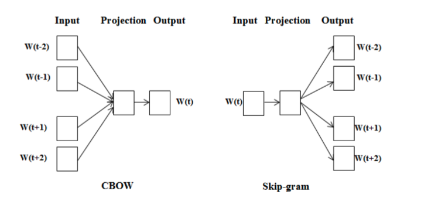
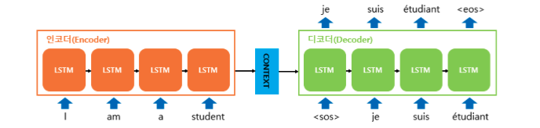
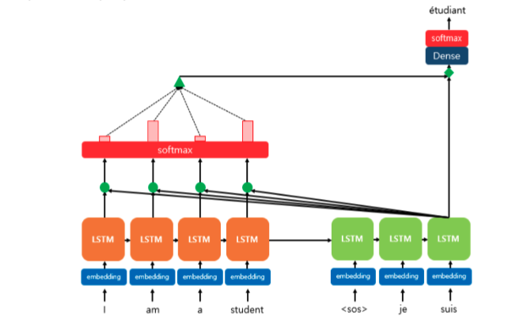
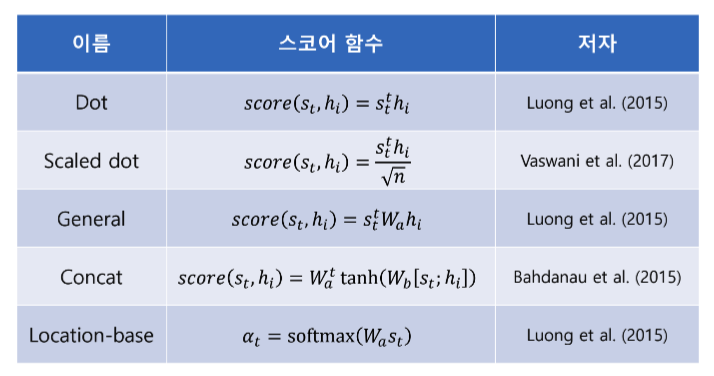
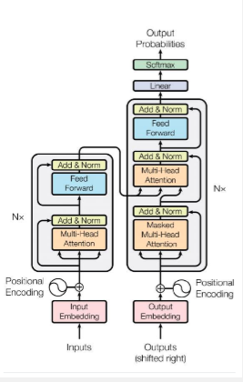
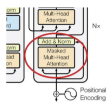
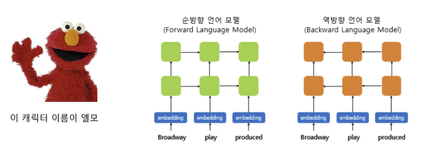
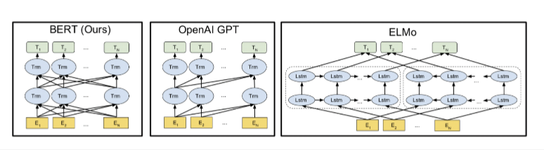

# 딥러닝 모형을 이용한 자연어 처리

## 자연어 처리와 딥러닝

**자연어 처리의 역사**

1980 후반 : 자연어 데이터의 축적, 컴퓨팅 능력이 좋아지면서 규칙보다 통계 기반 방법이 확산되기 시작. 

- 통계적 기계번역 (SMT)은 평행 코퍼스에서 조합 확률이 가장 높은 문장을 선택하는 접근

2000 초반 : 통계 기반 번역 서비스를 제공 

2016 : 신경망 기반 번역 (NMT)로 전환

딥러닝 전환 타임라인 :

- 2013 Word2Vec (단어 임베딩), 2014 Seq2eq (번역), 2015, Attention, 2017 Transformer, 2018 ELMo. BERT 

## 단어 임베딩

**자연어 처리에서 가장 먼저 해야 하는 일로, 단어 또는 문장을 숫자로 표현하는 것**

### 단어 주머니 (Bag of Words, Bow)

- 모든 단어에 인덱스를 주고 원-핫으로 표현하는 가장 단순한 수치화 
- 가장 단순한 방법
- 단점
  - 차원이 높아질수록 희소적이고 비효율적이다. 
  - 단어 간의 유사성을 표현할 수가 없다. 
  - 새로운 단어가 들어올 때 처리가 어렵다. 

### Word2Vec

**단어를 원-핫처럼 '서로 완전히 독립된 기호'가 아니라, 의미 공간의 실수 벡터(보통 50~300차원)으로 표현**

- 2013년 구글의 미코로프가 제안
- 자연어를 학습해 단어를 숫자 벡터들로 분산 표현하는 방법
- 같은 맥락에서 자주 함께 등장하는 단어들의 벡터가 **가깝도록 학습**
  - 원핫 인코딩으로 희소하게 표현된 고차원 단어군을 신경망을 통해 주성분 분석과 같이 **저차원의 의미가 포함된 밀집 벡터**로 다시 표현하는 것
  - **코사인 유사도** 등으로 계산할 수 있음. 

**구조**

<!-- 이미지 1 첨가 -->

**CBOW** (Continuous Bag of Words) 

- 단어의 앞뒤 **n개의 인접단어**로부터 중앙단어를 예측하는 신경망을 만들고, 이 신경망의 가중치 행렬로부터 숫자 벡터를 구하는 방법 
- 즉, **주변 단어를 입력으로 받아 중심 단어를 예측**하는 모델
- 동작원리
  - 주변 단어들의 원-핫 벡터를 임베딩층을 통과시켜 **임베딩 벡터**로 변환
  - 임베딩 벡터들의 평균을 구하여 맥락 벡터를 생성
  - 이 벡터를 두 번째 가중치 행렬에 곱해 중심 단어 후보들의 확률을 계산
  - 실제 중심 단어의 확률을 최대화하도록 학습

**Skip - gram**

- 중앙의 단어로부터 앞뒤 단어를 예측하는 신경망을 만들고 이 신경망의 가중치 행렬로부터 숫자 벡터를 구하는 방법
- CBOW와 반대. **중심 단어를 입력으로 주고, 주변 단어를 예측**하는 모델
- 동작원리
  - 중심 단어를 원-핫 벡터로 입력
  - 임베딩층을 통과하여 중심 단어의 임베딩 벡터를 얻음
  - 이 벡터를 이용해 주변 단어 각각이 나올 확률을 예측
  - 실제 주변 단어들이 예측되도록 파라미터를 학습 

> 계산량이 CBOW보다 많지만, **더 정교한 임베딩** 생성이 가능하다. 

### Seq2Seq

**모형**

<!-- 이미지 2 첨가 -->

- 입력 문장을 순화신경망의 은닉상태를 통해 문장의 내용을 압축한 맥락 벡터로 인코딩 한 이후 그 맥락 벡터를 디코더의 입력으로 사용해서 순차적으로 출력 문장을 생성
- 인코더에서 순차적으로 읽은 중간 단계의 은닉상태 값은 사용되지 않고, 맥락 벡터인 최종 은닉상태만 디코더에 전달된다. 
- 즉, **입력 문장의 단어 시퀀스를 받아 출력 문장 시퀀스를 생성하는 모델**

- 두 개의 RNN (또는 LSTM / GRU)으로 구성되어 있음.

**한계**

1. 문장이 길수록 번역의 품질이 급락함.
   - 은닉상태가 자연어의 복잡한 정보를 담기에 충분히 크지 않을 때, 최종 은닉상태만으로 입력 데이터 전체 문장을 대표하기가 어렵다. (**장기 의존성 문제**)
2. 순환신경망으로 만들어지기에 문장(시퀀스)의 길이가 길어질수록 경사소실 또는 경사폭발 문제가 커진다. 
3. 같은 단어라도 위치와 상황에 따라서 의미가 달라지는 언어의 특성을 반영하기가 어렵다. 

### 어텐션

**Seq2Seq** 모형의 문제를 해결하기 위함. (인코더의 전체 문장 정보를 최종 은닉상태에만 요약하여 디코더에 전달하기 때문에 문장이 길 때 제대로 번역하지를 못한다.)

- 디코더에서 출력 단어의 예측 시점마다 입력되는 전체 문장 정보를 다시 검토하여 관련이 높은 입력 문장의 단어에 더 비중을 두어서 출력 단어를 예측한다. 
- 디코더가 단어를 예측할 때, 입력 문장 (인코더의 모든 hidden state)을 **가중합 (weighted sum)**으로 참조하도록 하는 메커니즘 

**구조**

<!-- 이미지 3 첨가 -->

**Dot-product attention**

- 디코더의 세번째 LSTM 셀에서 출력단어를 예측할 때, 어텐션 메커니즘을 사용하는 모습
- 디코더의 1,2번째 LSTM 셀은 이미 어텐션 메커니즘을 통해 je와 suis를 예측하는 과정을 거쳤다고 가정 
- 세번째 LSTM 셀은 출력단어를 예측하기 위해 인코더의 모든 입력단어들의 정보를 다시 한 번 참고한다. 

> 그림 설명
>
> - 빨간 직사각형 크기 : 소프트맥수 함수의 결과값의 크기
>   - 사각형의 크기가 클수록, 도움이 되는 정도가 큼
> - 결과적으로 디코더는 출력 단어를 더 정확하게 예측할 확률이 높아진다. 

**다양한 종류의 어텐션들**

<!-- 이미지 4 첨가 -->

## 트랜스포머 (Transformer)

Seq2Seq 모형에서 순환신경망을 제거하고, 어텐션 메커니즘만 이용한 트랜스포머를 제안

> 2018년 소개된 BERT를 비롯한 문장 임베딩 모형들의 근간이 됨.

**Seq2Seq 모형과 트랜스포머**

- Seq2Seq 모형의 병목현상 : 다양하고 복잡한 문장들을 맥락 벡터에 담아내기에는 은닉상태의 크기가 부족해 최종 은닉상태만으로 입력 데이터 전체 문장을 대표하기 어려운 **장기 의존성** 문제
- 어텐션 메커니즘을 이용해 출력 문장의 매 토큰마다 입력 문장의 모든 토큰의 정보를 바탕으로 맥락 벡터를 계산하여 입력 문장의 특성을 보다 잘 반영할 수 있게 되었다. 
- 순환신경망에 행렬연산이 추가되어서 연산의 부담이 커지고, 순차적으로 연산할 수 밖에 없는 순환신경망이라는 제약이 있었다. 

> 이 제약을 극복하기 위해 제안된 모형 => 트랜스포머 
>
> **Recurrent 구조를 완전히 제거하고, Attention 만으로 시퀀스를 처리하는 모델**

**트랜스포머의 구조**

<!-- 이미지 5 첨가 -->

- 왼쪽의 인코더와 오른쪽의 디코더로 이루어져 있다. 
  - 여전히 **Encoder - Decoder** 형태이지만, **RNN 대신 전부 Self-Attention과 Feed-Forward Layer**로 구성
- 인코더 
  - 입력문장을 구성하는 토큰의 시퀀스들을 받아서 임베딩층을 거쳐 정해진 크기의 벡터로 변형
  - 여기에 위치 인코딩을 더해서 토큰의 위치 정보를 가미한 후에 N개의 인코더 트랜스포머 블록을 거친다. 
  - 입력과 출력의 크기 = `문장의 길이' X '임베딩 크기'`
  - 최종 출력은 N개의 디코더 트랜스포머 블록을 거칠 때마다 여러 개의 어텐션으로 구서된 멀티-헤드 어텐션의 입력으로 사용 
- 디코더 
  - 위의 정보를 받고 난 이후 디코더 트랜스포머 블록을 통과하고 나면, 마지막으로 밀집신경망을 거친 후에 소프트맥스 함수를 적용해 토큰을 예측함. 

### 입력과 임베딩

- 원-핫 벡터에서 해당 토큰의 인덱스로 입력을 받는다.
- 문장 벡터 전체를 하나의 행렬로 간주하고, 행렬 연산을 진행하기에 연산시간이 획기적으로 줄어든다. 
- 전체 문장을 한 번에 신경망에 입력 -> 단, 추론할 때 디코더는 순차적으로 토큰을 받음. 
- 인코더와 디코더는 같은 임베딩 층을 고려함. 

> 트랜스포머는 구조상 입력 시퀀스 전체가 입력되기에 토큰들 간의 순서를 알 수가 없다. 
>
> - 이를 보완하기 위해 위치를 나타내주는 정보를 임베딩에 더하는 **위치 인코딩**을 이용함. 

### 셀프 어텐션

**입력 시퀀스의 모든 단어가 서로를 참고하는 방식**으로 문맥을 이해 

> 트랜스포머에서는 두 가지 형태의 어텐션이 사용된다. 
>
> - 일반적인 어텐션 : 병렬 코퍼스가 주어졌을 때 사용
> - 셀프 어텐션 : 하나의 시퀀스가 주어졌을 때 사용

두 개의 다른 어텐션을 스케일드 닷-프로덕트 어텐션으로 통합

**구조적 개념**

| **이름**      | **의미**  | **역할**                             |
| ------------- | --------- | ------------------------------------ |
| **Q (Query)** | 질의 벡터 | “내가 지금 어떤 정보를 찾고 싶은가?” |
| **K (Key)**   | 키 벡터   | “내가 가진 정보는 어떤 특징인가?”    |
| **V (Value)** | 값 벡터   | “내가 전달할 실제 정보는 무엇인가?”  |

### 마스킹

<!-- 이미지 6 첨가 -->

Attention 계산 시 특정 단어나 토큰이 다른 단어를 **참조하지 못하도록 막는 역할**을 수행한다. 이것을 안할 때, **미래 단어를 미리 보고 예측하는 부정행위**가 생길 수 있다. 

- 출력 시퀀스를 만들어낼 때 순차적으로 입력

### 멀티-헤드 어텐션

**하나의 어텐션으로는 다양한 의미를 동시에 반영하기 어렵기 때문에 여러 개의 어텐션 헤드(head)를 병렬로 학습시킨다.**

예시)

~~~
Head 1 -> 문법적 관계
Head 2 -> 의미적 유사성
Head 3 -> 위치 정보 
: 이를 모두 concat 하여 최종 표현으로 만든다. 
~~~

### 스킵 연결

- 6개의 트랜스포머 블록을 통과하는 아주 큰 모형 : 경사가 소실되어 신경망의 입력으로 갈수록 학습이 잘 되지 않는다. 
  - 경사정보를 멀티-헤드 어텐션을 거치지 않고, 바로 이전의 입력값으로 넘김으로써 입력에 가까운 층에 보다 명확한 경사를 전달 

### 위치기반 순방향 신경망

- Position-wise Feed-Forward Network
- 완전 연결 신경망 두 개 층 사이에 ReLU 함수 적용 

### 디코더 신경망

- 인코더 블록과 구조가 유사 
- 셀프 어텐션과 더불어 인코더의 정보와 디코더의 정보를 섞기 위한 어텐션도 같이 적용되었다는 점에서 인코더 블록과 차이가 존재 
- 마스킹이 모든 셀프 어텐션에 적용된다. 

> 그렇게 출력 -> 추론 과정을 거침

### 추론

**한 단어씩** 예측하면서 문장을 완성해 나가는 과정

- 전체 문장을 동시에 보지 않고, **직전까지 생성된 토큰만을 이용해서 다음 단어를 예측**한다. 

> 요약 :
>
> (1) 입력 토큰화 : 각 토큰은 임베딩 벡터 + 위치 인코딩을 합산하여 입력됨.
>
> (2) Self-Attention 계산 : 각 단어가 **자기 자신 및 이전 단어만 볼 수 있게** 마스킹을 적용
>
> (3) FFN : Attention의 출력을 비선형 변환, 
>
> (4) Softmax 를 통한 다음 토큰 확률 계산 : 가장 확률이 높은 단어 NLP 선택
>
> (5) 반복 : 이를 반복하여 한 단어씩 예측하여 문장을 완성

## ELMo

**ELMo = Embeddings from Language Model**

- 문맥에 따라 **동적으로 변하는 단어 임베딩**을 만들어주는 모델 
- 이전의 Word2Vec, GloVe와 달리 단어가 사용된 **문맥 (context)**에 따라 벡터가 달라진다. 
  - 문맥속에서 이해하기 위해 단어 임베딩을 **양방향 LSTM**으로 부터 얻는다. 

<!-- 이미지 7 첨가 -->

**단계**

1) 각 층의 출력값을 연결 한다.
2) 각 층의 출력값 별로 가중치를 준다.
3) 각 층의 출력값을 모두 더한다.
4) 벡터의 크기를 결정하는 스칼라 매개변수를 곱한다.

> ELMo 벡터 = **각 층의 Hidden state**를 가중합한 값

## Pre-training in NLP

**사전학습** : 대규모 일반 텍스트 데이터로 **언어의 일반적 패턴**을 학습시킨 후, **특정 task**에 맞게 **Fine-tuning**하는 방식

워드 임베딩 = 딥러닝 자연어 처리의 기본

**문제점** : 문맥에 따라서 뜻이 달라질 수 있음. 

-> 해결 방법 : 언어 모델을 사전 훈련 시켜서 문맥에 따른 표현을 얻는다. 

> Improving Language Understanding by Generative Pre-Training, OpenAI, 2018 = GPT의 시작

**또 생기는 문제점** : 언어 모델은 정방향 또는 역방향으로만 진행된다. 언어의 문맥이라는 것은 양방향을 통해서 결정이 된다.

-> 해결 방법 : 훈련 데이터 단어 중 K%의 단어를 [MASK]로 변경하여 이를 예측하도록 한다. 

- 80% : token을 [MASK]로 바꿈
- 10% : token을 random word로 바꿈

## BERT

**Bidricetional Encoder Representations from Transformers**

Fine-tuning 방식을 취하되, GPT와는 달리 양방향을 실현한다. 

- 트랜스포머 블록을 활용하였으나 학습 구조에 차이가 존재
- 인코더와 디코더로 이루어져있지만, BERT는 인코더만으로 이루어져있음

### 토크나이저

- 입력된 텍스트를 모델에서 처리할 수 있는 데이터로 변환하는 알고리즘
- **트랜스포머** : 형태소 기반 토크나이저 
- **BERT** : 문장 기반 센텐스피스 토크나이저

> 입력 및 임베딩 
>
> - WordPiece Embedding : 실질적인 입력이 되는 워드 임베딩 - 단어 집합의 크기로 30,522개
> - Position Embedding : 위치 정보를 학습하기 위한 임베딩 - 문장의 최대 길이인 512개
> - Segment Embedding : 두 개의 문장을 구분하기 위한 임베딩, 벡터의 종류 문장의 최대 개수 2개

### 마스크 언어 모형

자연어처리의 언어모형은 나열된 단어에 확률분포를 적용하는 것

BERT에서는 언어모형을 학습하되, 양방향 상호의존성을 고려함.

- 양방향 모델링을 위해 트랜스포머의 인코더 블록을 활용

<!-- 이미지 8 첨가 -->

### 다음 문장 예측

- 질의응답와 자연어추론과 같이 문장들 간의 관계를 파악할 수 있다.
- CSL, SEP 토큰 사용

**BERT-BASE** vs **BERT-LARGE**

- 인코더를 12층 / 24층을 쌓음

## 아직 남은 과제들

**1. 한 문장 분류 과제**

**입력 : 한 문장**

**출력 : 해당 문장의 전체 의미에 대한 라벨 (감정, 문장 유형 등)**

- [CLS] 토큰의 최종 hidden state 벡터 (768차원, Base 기준)을 가져와서

  → **Dense Layer + Softmax** 로 분류

$$
y = \text{Softmax}(W \cdot h_{[CLS]} + b)
$$

**2. 문장 쌍 분류 과제**

**입력:** 두 문장

**출력:** 두 문장 간의 관계 (동의, 모순, 연속 여부 등)

- [CLS] 벡터 → Dense Layer → Softmax (Entailment / Neutral / Contradiction)

$$
y = \text{Softmax}(W \cdot h_{[CLS]} + b)
$$

**3. 질의응답 과제**

**입력:** 질문(Question) + 문서(Context)

**출력:** 문서 내에서 답이 위치한 **시작 인덱스와 끝 인덱스**

BERT의 각 토큰(hidden state)에 대해

- Start layer: “답이 시작되는 위치” 확률
- End layer: “답이 끝나는 위치” 확률

$$
P_{start}(i) = \text{Softmax}(W_s \cdot h_i), \quad P_{end}(i) = \text{Softmax}(W_e \cdot h_i)
$$

**4. 한 문장 태깅 과제**

**입력:** 한 문장

**출력:** 각 단어(토큰)에 대한 라벨 (품사, 개체, 구문 등)

- 각 토큰의 hidden state h_i 에 대해 개별 softmax 수행:

$$
y_i = \text{Softmax}(W \cdot h_i + b)
$$

